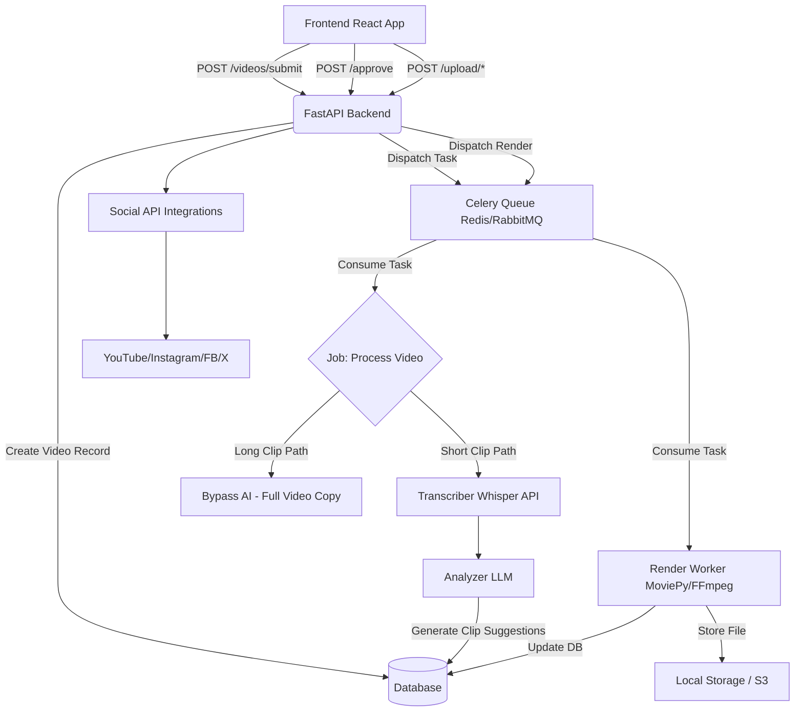

# AI Video Clipper: Complete System Architecture & Breakdown

This document provides a comprehensive analysis of the AI Video Clipper platform, detailing the end-to-end user flow, the internal processing pipeline, AI integrations, and a scalable production-ready architecture designed for AWS.

---

## 1. End-to-End User Flow

1. **Input Stage (Frontend)**
   - The user accesses the web application (built with Next.js).
   - They provide a video source via:
     - **YouTube URL**: Pasted into the input field.
     - **Local File Upload**: Drag-and-dropped or selected from the local file system.
   - Upon providing the source, the user selects the output type:
     - **Short Clip**: The system automatically uses AI to slice the video into 9:16 vertical viral shorts.
     - **Long Clip**: The user explicitly chooses the aspect ratio (16:9 horizontal or 9:16 vertical) for full-length processing.
2. **Processing Stage (Backend & Workers)**
   - The frontend sends the request to the FastAPI backend.
   - The backend records the video source in the database (status: `ANALYZING_METADATA`) and dispatches an asynchronous job to Celery.
   - **For Short Clips**: The background worker downloads/transcribes the video, passes the transcript to an LLM for viral segment detection, and creates clip suggestions awaiting the user's approval.
   - **For Long Clips**: The worker skips AI transcription/analysis. It directly passes the full video into the clips folder retaining the selected aspect ratio.
3. **Review & Rendering**
   - The user views the generated "Clip Suggestions" via the frontend (for Short Clips).
   - They can approve specific clips and choose the target quality (4K, 1080p, 720p).
   - Approval triggers a `render_clip` task in Celery, which uses MoviePy/FFmpeg to slice the video, reframe it, and generate a thumbnail.
4. **Publishing & Social Integration**
   - The rendered clips are displayed on the video details page.
   - The user can connect their social media accounts via OAuth 2.0.
   - The user seamlessly uploads the finalized clip (with AI-generated hashtags, titles, and descriptions) directly to YouTube, Instagram Reels, Facebook, or X (Twitter).

---

## 2. Internal Processing Pipeline

The backend leverages a decoupled architecture utilizing FastAPI for synchronous API requests and Celery for intensive background video tasks.

---

## 3. AI Integrations: Stage-by-Stage Mapping

The platform strategically uses various AI models to construct intelligent narrative clips rather than blindly cutting at random timestamps.

| Stage | AI Provider | Purpose | API / Model |
| :--- | :--- | :--- | :--- |
| **Speech-to-Text (Transcription)** | OpenAI | Convert video audio into high-accuracy text with precise timestamps (SRT format) to ensure accurate cutting points. | `whisper-1` via `client.audio.transcriptions` |
| **Viral Content Analysis** | User's Choice (OpenAI / Anthropic / Gemini) | Analyze the transcript timeline to find "Narrative Units" (Hook, Core, Conclusion). It evaluates hook strength, emotional engagement, and message clarity to calculate a viral score. | OpenAI (`gpt-4o`), Anthropic (`claude-3-5-sonnet`), Gemini (`gemini-1.5-pro`) |
| **Metadata Generation** | User's Choice | Automatically generate SEO-optimized titles, descriptions, and platform-specific hashtags for the detected clip. | (Done concurrently with Viral Content Analysis) |

_Note: AI validation ensures clip diversity (stops overlapping clips) and prevents the "lazy cutting" error where models only extract from the very beginning of the video._

---

## 4. Production-Ready System Architecture

To scale this application from a local environment to a robust production system handling concurrent video uploads and ML workloads, here is the recommended architecture.

### Tech Stack Recommendation
* **Frontend**: Next.js (App Router), React, Tailwind CSS, Lucide Icons.
* **Backend**: Python 3.11+, FastAPI, SQLAlchemy (Async), Pydantic.
* **Async Workers**: Celery backed by Redis.
* **Database**: PostgreSQL 15+.
* **Video Engine**: FFmpeg and MoviePy (Python wrapper).
* **Storage**: Amazon S3 (Raw video inputs, final rendered clips, thumbnails).

### Scalable AWS Architecture
1. **Edge & Delivery**
   - **Amazon CloudFront**: Acts as the CDN to deliver the Next.js frontend assets and stream the generated `.mp4` video clips rapidly to global users.
2. **Compute Layer**
   - **Frontend Hosting**: Vercel (recommended for Next.js) or AWS Amplify.
   - **Backend API**: **Amazon ECS (Fargate)** or **Amazon EKS**. Containerized FastAPI app deployed behind an Application Load Balancer (ALB). Fast autoscaling based on HTTP traffic.
   - **Worker Nodes**: **Amazon ECS on EC2** (Not Fargate). Video processing (FFmpeg, network IO for downloads) requires heavy CPU/Memory combinations. EC2 instance types like `c6i` (Compute optimized) or even `g4dn` (GPU-backed) if hardware-accelerated video rendering is implemented.
3. **Queue & Caching**
   - **Amazon ElastiCache (Redis)**: Serves as the high-throughput message broker for Celery, passing jobs from FastAPI to the video processing workers, and caching active OAuth session states.
4. **Data Persistence**
   - **Amazon S3**: Infinite object storage. Replaces local `data/clips` folder. Crucial for handling large video files that would rapidly exhaust EBS volumes.
   - **Amazon RDS (PostgreSQL)**: Replaces local SQLite. Manages user data, OAuth tokens, video states, and AI configurations safely with Multi-AZ redundancy.
5. **AI Connectivity**
   - External API calls to OpenAI, Google, and Anthropic are inherently scalable, requiring no internal hosting, provided API rate limits are accounted for with exponential backoff in Celely configuration.

---

## 5. Future Expansion Suggestions

1. **Hardware-Accelerated Rendering**: Shift from MoviePy to direct FFmpeg bindings explicitly utilizing NVIDIA NVENC wrappers on AWS GPU instances to reduce 4K rendering times by ~75%.
2. **Face Tracking & Dynamic Cropping**: Implement an intermediate OpenCV/MediaPipe pipeline before rendering to track faces on the X-axis, ensuring the speaker is always centered in the 9:16 frame.
3. **B-Roll & Captions**: Integrate an AI Image/Video generator (like Runaway or Pexels API) to overlay B-Roll on silent segments, and use Whisper's word-level timestamps to overlay trendy animated text captions.
4. **Serverless Transition for Minor Tasks**: Move the LLM prompt phase out of heavy EC2 workers and into AWS Lambda to optimize cost since it is heavily I/O network bound (waiting for OpenAI) rather than CPU bound.
