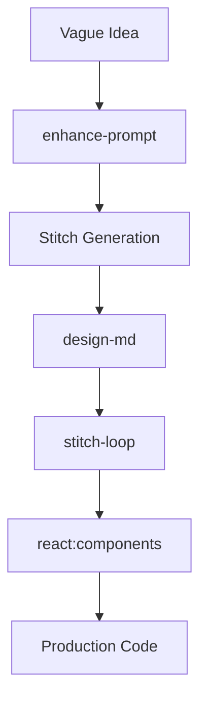

# Stitch Usage Guide

Welcome to Stitch! You now have a powerful suite of skills to design and build web applications autonomously. Here is the recommended workflow:

## 1. The "Big Picture" Workflow

## 2. Key Skills Explained

| Skill | When to Use | Command/Action |
| :--- | :--- | :--- |
| **`enhance-prompt`** | You have a rough idea but want a professional design. | Ask me to "enhance this prompt: [your idea]" |
| **`design-md`** | You have one screen and want to keep all future screens consistent. | Ask me to "generate DESIGN.md from my project" |
| **`stitch-loop`** | You want to build a multi-page site iteratively. | Ask me to "start a stitch build loop for [vision]" |
| **`react:components`** | You love the design and want it in your code. | Ask me to "convert my stitch screen to react" |
| **`shadcn-ui`** | You need modern, accessible components. | Ask me "how to add shadcn components to this design" |
| **`remotion`** | You want a video to show off your work. | Ask me to "create a remotion video of my screens" |

## 3. Let's Build Something!

To get started, I recommend we build a **Feature Dashboard** for your project. This will demonstrate the full cycle.

### Step 1: Enhance the Prompt
I will take your idea (e.g., "a dashboard showing AI news clusters") and professionalize it.

### Step 2: Generate the Design
I'll use the Stitch MCP tools to generate a high-fidelity mockup.

### Step 3: Extract the Design System
I'll create a `DESIGN.md` so we can maintain this "vibe" throughout the project.

### Step 4: Convert to Code
I'll turn that design into modular React components in your `frontend/` folder.

---
**Ready to start?** Just say "Let's build the Feature Dashboard!"
